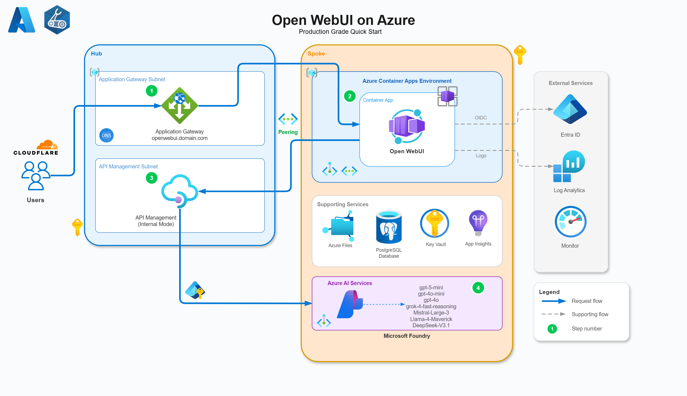

# Open WebUI on Azure - Production Grade Quickstart

Deploy [Open WebUI](https://github.com/open-webui/open-webui) on Azure Container Apps with Entra ID authentication, Microsoft (Azure) Foundry integration, and Application Gateway.

## Architecture




## Features

- **Open WebUI** on Azure Container Apps with native OAuth/OIDC Entra ID integration
- **Microsoft Foundry** with multiple models (GPT, Grok, Mistral, Llama, DeepSeek) using Managed Identity
- **Application Gateway** with custom domain and SSL termination
- **API Management with AI in Azure** Delegate API keys per team/user(s) with token tracking, limits, usage metrics, Entra OAuth policy validation
- **No secrets!** Managed Identity + OIDC throughout*
- **Infrastructure as Code** using Bicep with Azure Verified Modules
- **Secure by default** using internal ingresses and private endpoints**

> [!NOTE]
> *Azure Container Apps still [requires Storage Account Access Keys for Azure File SMB mount?](https://learn.microsoft.com/en-us/azure/container-apps/storage-mounts-azure-files?tabs=bash#set-up-a-storage-account) :(
> **At the time of writing the 'New' Foundry account does not support BYOD/Fully private networking yet. It has been secured via ACL for inbound networking.

## Prerequisites

- Azure subscription(s) Owner access with Azure CLI and Bicep installed
- Custom domain with DNS provider (Cloudflare used in examples)
- SSL certificate (Cloudflare Origin Certificate for Full strict SSL mode and custom domain on ACA env)
- Application Developer Role (Entra)

## Deployment

> [!IMPORTANT]
> Before deploying, update `infra/bicep/main.bicepparam` with your values:
> - `parApimPublisherEmail` - Your email address
> - `parApimPublisherName` - Your name
> - `parCustomDomain` - Your custom domain (e.g., `openwebui.example.com`)
> - `parLocation` - Your Azure region

### 1. Deploy Spoke Infrastructure (Container Apps, Foundry)

Deploy the spoke first to get Container App FQDN and Foundry endpoint:

```bash
# Create passwordless PFX and base64 encode it
openssl pkcs12 -export \
  -out cloudflare-origin.pfx \
  -inkey origin.key \
  -in origin.pem \
  -password pass:

cat cloudflare-origin.pfx | base64 -w0 > pfx.b64

# Deploy spoke infrastructure
az deployment sub create \
  --location uksouth \
  --template-file infra/bicep/app.bicep \
  --parameters infra/bicep/app.bicepparam \
  --parameters parCertificatePfxBase64="$(cat pfx.b64)"
```

**Note these outputs for Step 2:**
- `outContainerAppFqdn` - Container App FQDN
- `outVirtualNetworkName` - Spoke VNet name
- `outFoundryEndpoint` - Microsoft Foundry endpoint URL
- `outOpenWebUIAppId` - Entra ID app ID (for Step 3)

**Also note the Container App Environment static IP:**
- Azure Portal → Container Apps Environment → Properties → Static IP → Add to `parContainerAppStaticIp`

**Grant Admin Consent (one-time):**
1. Azure Portal → **Entra ID** → **App registrations** → **app-open-webui**
2. **API permissions** → **Grant admin consent**

### 2. Deploy Hub Infrastructure (APIM, Application Gateway)

Update `infra/bicep/main.bicepparam` with values from Step 1:
- `parContainerAppFqdn` - Use `outContainerAppFqdn` from Step 1
- `parContainerAppStaticIp` - Container App Environment static IP
- `parSpokeVirtualNetworkName` - Use `outVirtualNetworkName` from Step 1
- `parFoundryEndpoint` - Use `outFoundryEndpoint` from Step 1

Deploy hub infrastructure:

```bash
az deployment sub create \
  --location uksouth \
  --template-file infra/bicep/main.bicep \
  --parameters infra/bicep/main.bicepparam
```

**Note outputs:**
- `outApimName` - APIM instance name
- `outAppGatewayPublicIp` - Application Gateway public IP

**Configure DNS:**
- Add A record pointing to Application Gateway public IP (`outAppGatewayPublicIp`)
 
**If using Cloudflare:**
- Enable proxy (orange cloud)
- Set SSL/TLS mode to **Full (strict)**

### 3. Redeploy Hub with Entra App ID

Now redeploy the hub to enable APIM Entra ID token validation:

```bash
az deployment sub create \
  --location uksouth \
  --template-file infra/bicep/main.bicep \
  --parameters infra/bicep/main.bicepparam \
  --parameters parOpenWebUIAppId='<outOpenWebUIAppId-from-step-1>'
```

This updates APIM policies to validate Entra ID tokens from the Open WebUI app.

### 4. Import OpenAPI Spec to APIM

> [!NOTE] 
> This step is required due to Bicep's character limit on inline content. The OpenAPI spec must be imported manually via Azure CLI.

```bash
az apim api import \
  --resource-group rg-lb-core \
  --service-name <apim-name> \
  --api-id openai \
  --path "openai/v1" \
  --specification-format OpenApiJson \
  --specification-path infra/bicep/openapi/openai.openapi.json \
  --display-name "Azure OpenAI v1 API" \
  --protocols https \
  --subscription-required true
```

## Configuration

### Connect Open WebUI to Microsoft Foundry

1. Navigate to Open WebUI and log in with Entra ID
2. Go to **Admin Settings** → **Connections**
3. Add OpenAI-compatible connection:
   - **API Base URL**: `https://<apim-name>.azure-api.net/openai/v1`
   - **Headers**: Get from APIM subscription
   ```json
   {
    "api-key": "<sub-key>"
   }
   ```
   - **API Type**: `OpenAI`
   - **Auth**: `OAuth`
   - **Model Ids**: Input all models deployed to Foundry,e.g. `gpt-5-mini`